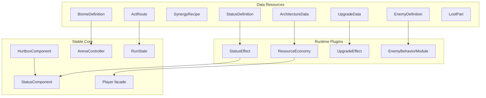
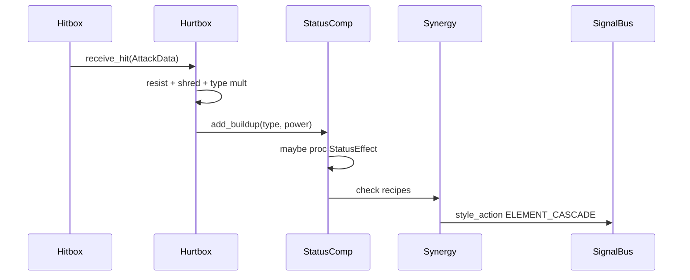

# EON — План расширяемых систем

Цель: механики из дизайн-брифа (архитектуры, стихии/синергии, биомы/акты, враги, крафт) ложатся на data + плагины, без правок ядра боя при добавлении контента.

Уже есть каркас: `ArchitectureData`, `BiomeDefinition`, `EnemyDefinition`, `UpgradeData`, `StatusComponent`, `RunState`, `SignalBus`, контракт в [`docs/systems.md`](systems.md). Ниже — как довести до «контент = .tres + маленький скрипт эффекта», и закрыть разрывы с брифом.

---

## 0. Принцип слоёв



Правило: **ядро знает интерфейсы, не конкретные билды.** Новая архитектура = `.tres` + (при новой экономике) один `ResourceEconomy` скрипт. Новый враг = `EnemyDefinition` + опциональный behavior-модуль. Новый апгрейд = `UpgradeData` + `UpgradeEffect` ресурс/скрипт.

### Аудит: уже в коде, но не подключено

Быстрые wins до/вместе с Phase A–B (не требуют новой архитектуры плагинов):

| Есть | Не используется | Куда воткнуть |
|------|-----------------|---------------|
| `StatusComponent.get_action_speed_multiplier()` | Нет callers | windup/cooldown атак игрока и enemy FSM |
| Overheat runtime (`Player.overheat`) | Нет полоски в HUD | `economy.get_hud_values()` → `debug_hud` |
| `BiomeDefinition.faction_ids` / `element_bias` | Спавн игнорирует | `ArenaController` / wave pick weights |
| `grant_loot_for_room_rank()` `biome_tags` | Пустой массив | заполнять из `current_biome.loot_tags` |
| `default_counter.tres` | Только `damage_mult`; counter window всегда от perfect dodge | сделать `UpgradeEffect` который **включает** counter, базовый dodge без бонуса |
| Electro-Train upgrades | Пул крафта пуст | 1–2 `UpgradeData` на `train`/`plasma` tags |

Бой, три архитектуры, parry/dodge/style/craft-теги — **уже работают**; дальше в основном вынос из `match`/bool и выравнивание с брифом.

---

## 1. Архитектуры и экономики ресурсов

### Проблема сейчас

- `RunState.choose_architecture` — жёсткий `match` + preload трёх `.tres`.
- `Player._process_architecture_economy` / `try_spend_*` — `match economy_policy`.
- UI (`run_overlay`) — три захардкоженные кнопки.
- Overheat — только lockout, без жёлтой/красной зоны и Vent.
- Nano — drain энергии, а не «Кровавая жатва» (HP).
- Default — парирование всё ещё тратит энергию; адреналин не ускоряет атаку явно.

### Решение: `ResourceEconomy` как стратегия

Новый базовый класс (Resource или RefCounted, держится на Player):

```gdscript
# systems/economy/resource_economy.gd
class_name ResourceEconomy
extends Resource

func on_equip(host: Player) -> void: pass
func on_unequip(host: Player) -> void: pass
func tick(host: Player, delta: float) -> void: pass
func can_afford(host: Player, action: StringName, cost: float) -> bool: return true
func spend(host: Player, action: StringName, cost: float) -> bool: return true
func on_style_action(host: Player, action: int) -> void: pass
func damage_multiplier(host: Player) -> float: return 1.0
func attack_speed_multiplier(host: Player) -> float: return 1.0
func get_hud_values(host: Player) -> Dictionary: return {}  # {primary, secondary, labels}
```

Конкретные политики (по одной на файл):

| Policy | Класс | Поведение по брифу |
|--------|--------|-------------------|
| ENERGY_ADRENALINE | `EconomyAdrenaline` | Базовые атаки / dodge / parry **не тратят** энергию, генерируют адреналин. Спец-действия (`special`, heavy dash, shield throw) тратят Energy. Адреналин → regen Energy + attack speed. |
| NANO_SWARM → переименовать смысл в **BLOOD_HARVEST** | `EconomyBloodHarvest` | Нет Energy. Пассивный % max HP drain (или spend HP на скиллы). Life steal / heal от заражённых + киллов. |
| OVERHEAT | `EconomyOverheat` | Шкала Heat. 50–90% = ×1.5 + apply burn; 100% = ×2 + self-burn DoT. Action `vent` → AoE по накопленному Heat + weapon cooldown. |
| RAM_COMPUTE (новый) | `EconomyRam` | N слотов. Призыв/вирус/приманка занимает слот; освобождение по смерти саммона/цели. |

`ArchitectureData` упростить:

```gdscript
@export var architecture_id: ...
@export var display_name: String
@export var economy: ResourceEconomy   # вместо enum + кучи tunables
@export var primitives: Array[WeaponData]
@export var starting_tags: PackedStringArray
@export var visual_tint: Color
@export var base_resists: ... # или оставить поля resists
```

`EconomyPolicy` enum можно оставить для UI/фильтров, но рантайм идёт через `economy` ресурс.

### Реестр архитектур (без match)

```gdscript
# resources/architectures/architecture_catalog.tres  (или .gd autoload scan)
@export var architectures: Array[ArchitectureData]
```

`RunState.choose_architecture(arch: ArchitectureData)` — принимает ресурс напрямую. UI строит кнопки из каталога. Добавить «Нейро-хакер» = новый `.tres` + `EconomyRam` + 3 weapon `.tres`, без правок `Player`/`RunState` логики выбора.

### Специальная кнопка

Единый input `special` (Vent / Shield throw / Swarm burst / Deploy drone). `Player` вызывает `economy.spend(host, &"special", 0)` / `economy.on_special(host)` — поведение внутри экономики.

### Имена в UI (маппинг брифа)

| Бриф | Id / display |
|------|----------------|
| Синтетик | DEFAULT / «Синтетик» |
| Улей | NANOMACHINES / «Улей» |
| Паровоз | ELECTRO_TRAIN / «Паровоз» |
| Нейро-хакер | NEURO_HACKER (новый enum) |

---

## 2. Стихии, статусы, синергии

### Проблема сейчас

- Статусы — константы + `match` в `StatusComponent` (DoT logic зашита).
- Нет **накопительных шкал** (buildup → proc), только duration/power.
- Нет синергий (Коррозия+Электричество → хим. замыкание).
- Нет GLITCH / паники от огня / acid puddle on death / chain lightning.

### Решение: data-driven статусы + buildup

**`StatusDefinition` (Resource):**

```gdscript
@export var status_id: StringName
@export var damage_type: GameplayEnums.DamageType  # optional link
@export var max_buildup: float = 100.0
@export var decay_per_sec: float = 8.0
@export var on_proc: StatusEffect   # scripted effect resource
@export var while_active: StatusEffect
@export var tick_interval: float = 0.4
```

**`StatusEffect` (Resource base):** виртуальные `on_proc(target)`, `on_tick(target, delta)`, `on_expire(target)`, `modify_outgoing/incoming_damage(...)`.

Примеры эффектов (маленькие скрипты):

- `EffectStaggerProc` — interrupt + crit window на следующий удар
- `EffectShockArc` — цепная молния по радиусу
- `EffectArmorShred` — +% incoming damage; on death → acid puddle scene
- `EffectBurn` — DoT; at full buildup → Panic (behavior flag)
- `EffectBleedMotion` — DoT scale by velocity / attacking flag
- `EffectGlitch` — confuse (атакуют союзников) или shutdown если faction ANDROID/CYBORG

**`StatusComponent`** хранит словарь `{status_id: {buildup, time_left, stacks}}` и делегирует в `StatusDefinition` из каталога (`StatusCatalog` autoload или exported dict). Больше никаких `match STATUS_BURN` в компоненте.

**Добавить в enums:** `DamageType.GLITCH`, статус `glitch`/`fault`.

### Синергии

`SynergyRecipe` Resource:

```gdscript
@export var required_statuses: PackedStringArray  # e.g. ["acid", "shock"]
@export var consume_on_trigger: bool = true
@export var effect: StatusEffect  # или отдельный SynergyEffect
@export var style_points: int = 120
```

`StatusComponent` / тонкий `SynergySystem` (Node на арене или autoload) слушает `SignalBus.status_applied` → если набор статусов на цели совпал с рецептом → `effect.apply` + `style_action(ELEMENT_CASCADE)`.

Новая синергия = один `.tres` в `resources/synergies/`, без правок Hurtbox.

### Поток урона (стабильный)



---

## 3. Биомы и маршрут забега

### Проблема сейчас

- `RunState.ROOM_SCENES` — 3 линейные комнаты, привязанные к сценам:
  - `room_01` → **Data Center**, `room_02` → **Gateway**, `room_03` → **Landfill** (обратный порядок относительно брифа «от окраин к ядру»).
- 10 `BiomeDefinition.tres` есть; в игре только 3. Остальные 7 — палитры/теги, часто шарят чужой `wave_set` (downtown/mall → data_center waves; jungle/taiga/wasteland → landfill waves).
- `faction_ids` / `faction_weights` / `element_bias` / `neighbor_biomes` — data-only, спавн и маршрут их не читают.
- Финальная комната (`is_final_room`) сразу `run_won` — **нет REWARD/craft** на последнем clear.
- Legacy `default_waves.tres` / `room_0x_waves.tres` не используются сценами.

### Решение: `ActRoute` + комнаты как узлы

```gdscript
# resources/runs/act_route.gd
class_name ActRoute
extends Resource
@export var acts: Array[ActDefinition]

# ActDefinition
@export var act_index: int
@export var biomes: Array[BiomeDefinition]  # пул акта
@export var rooms_in_act: int = 3
@export var boss_biome: BiomeDefinition  # optional
```

Маршрут по брифу (данные, не код):

| Act | Биомы |
|-----|--------|
| 1 Окраины | Landfill → Wasteland → Alley |
| 2 Мёртвый быт | Mall → Downtown → Residential |
| 3 Природа | Jungle → Taiga |
| 4 Ядро | Data Center (+ Gateway blends) |

`RunState` хранит `current_route: ActRoute`, `act_index`, `room_in_act`, `current_biome`. При clear:

1. grant loot by rank + biome.loot_tags  
2. pick next biome from `neighbor_biomes` / act pool (или фиксированный tutorial path)  
3. load room template (layout) + apply biome package via `ArenaController`

Комнатные layout'ы (`room_01/02/03`) остаются **геометрией**; биом красится и подставляет `wave_set`. Gateway = `blend_biome` уже в `BiomeDefinition`.

Добавление биома: `.tres` + wave_set + запись в нужный `ActDefinition` — без правок арены.

---

## 4. Враги и поведение

### Проблема сейчас

- Один `EnemyDummy` + `EnemyDefinition` (stats, attacks, kite flag, resists).
- Faction есть; нет BIO_MUTANT, нет death-explosion, medic/shield drone roles, dodge ranged, panic/glitch reactions.

### Решение: definition + behavior modules

Расширить `EnemyDefinition`:

```gdscript
@export var faction: GameplayEnums.Faction
@export var behavior_modules: Array[EnemyBehavior]  # resources
@export var on_death_effect: StatusEffect  # toxic cloud for BioMutant
@export var tags: PackedStringArray  # "shield_drone", "medic", "fast"
@export var status_vulnerabilities: Dictionary  # status_id -> mult
```

`EnemyBehavior` base:

- `BehaviorAggroSwarm` — дикари, числом  
- `BehaviorErraticDodge` — киборги, шанс ignore projectile  
- `BehaviorTacticalSupport` — android medic/shield  
- `BehaviorHyperChase` — robo-beast  
- `BehaviorDeathBurst` — био-мутанты  

AI states читают флаги/модули через `enemy.has_behavior(&"erratic_dodge")` вместо разрастания FSM на каждый архетип.

Faction enum += `BIO_MUTANT`. Реакции на статусы (panic run, glitch friendly-fire) — в behavior / status effects, не в Player.

Контент: существующие `bruiser/sniper/swarm/cyborg/android/robo_beast.tres` дополнить resists/vulnerabilities; добавить `bio_mutant.tres`.

---

## 5. Крафт / лут / улучшения («Сборка ядра»)

### Проблема сейчас

- `UpgradeData` с bool-флагами (`enable_hookshot`, …) → каждый новый глагол правит `Player.apply_run_upgrades`.
- Loot = выдача тегов по рангу комнаты (грубо).
- Нет Parts/Code как предметов.

### Решение: теги + эффекты + рецепты

**`LootPart` Resource:**

```gdscript
@export var part_id: StringName
@export var display_name: String
@export var tags: PackedStringArray  # arch / element / shape: "magnet", "bioreactor", "servo"
@export var rarity: int
```

После комнаты: roll parts из `biome.loot_tags` + style rank → `RunState.inventory`.

**`UpgradeData` без bool-поляны:**

```gdscript
@export var required_tags: PackedStringArray
@export var grant_tags: PackedStringArray
@export var architecture_filter: ...  # ANY or specific
@export var effects: Array[UpgradeEffect]
```

`UpgradeEffect` base: `apply(player)`, `remove(player)`, опционально `on_hit`, `on_kill`, `tick`.

Примеры: `EffectHookshot`, `EffectRoomInfect`, `EffectProximityPulse`, `EffectAdrenalineOnParry`, `EffectRamSlotPlus`.

Синергия предметов (ржавый магнит + серво + …) = upgrade с `required_tags` — уже заложено; достаточно наполнять `.tres`.

`Player` хранит `Array[UpgradeEffect] active_effects` и проксирует хуки (`on_melee_hit` → foreach effect). Новый апгрейд = новый effect-скрипт + `.tres`, **не** новые поля на Player.

---

## 6. Что вынести из Player / RunState (рефактор-порядок)

Критичные «запахи», которые блокируют контент:

1. `match economy_policy` → `architecture.economy.*`
2. `apply_run_upgrades` bools → `UpgradeEffect.apply`
3. `StatusComponent` match → `StatusDefinition`
4. `choose_architecture` match + overlay buttons → catalog
5. `ROOM_SCENES` → `ActRoute` + biome on room template

Не трогать стабильное ядро: Hitbox↔Hurtbox, FSM, SignalBus контракты (только добавлять сигналы: `resource_changed`, `vent_triggered`, `ram_slots_changed`, `synergy_triggered`).

---

## 7. Вертикальный срез внедрения (порядок работ)

### Phase A — Контракты и экономики (фундамент)
1. Ввести `ResourceEconomy` + перенести DEFAULT / NANO / OVERHEAT на стратегии.
2. Выровнять механику с брифом: Синтетик (free basics + adrenaline AS), Улей (HP harvest), Паровоз (zones + Vent).
3. `ArchitectureCatalog` + динамический arch-pick UI.
4. HUD: абстрактные primary/secondary bars из `economy.get_hud_values()`.

### Phase B — Статусы и синергии
1. `StatusDefinition` + buildup API.
2. Портировать burn/bleed/acid/shock/stagger на definitions.
3. Добавить GLITCH + 1–2 synergy recipes (Acid+Shock).
4. Style score за cascade (уже есть `ELEMENT_CASCADE`).

### Phase C — Улей/Паровоз полировка + крафт-эффекты
1. Переписать upgrades на `UpgradeEffect`.
2. `LootPart` + выпадение после комнаты.
3. Заполнить 3–4 крафта на Синтетик и Улей (магнит/биореактор как tag combos).

### Phase D — Биомный маршрут ✅
1. Tutorial path: Landfill → Wasteland → Data Center (`tutorial_route.tres`); layouts `room_*` = геометрия.
2. `ActRoute` / `ActDefinition` + `campaign_route.tres` (Acts 1–4). У каждого биома свой `wave_set`.
3. `faction_weights` → `EnemyCatalog.pick_for_biome` при спавне.
4. Финальная комната: exit → reward/craft → `run_won`.
5. Gateway blend → Data Center (переход к ядру).

### Phase E — Враги под стиль ✅
1. `EnemyBehavior` modules + `BIO_MUTANT` death burst.
2. `status_vulnerabilities` на definitions (savages↔burn, beasts↔bleed, androids↔shock, cyborgs↔glitch).
3. Нейро-хакер skeleton: `EconomyRam` + `ally_drone` + `neuro_extra_slot` (+1 RAM).

### Phase F — Контент-объём
Нейро-хакер полный, Acts 2–4, остальные синергии, trap props в биомах — только data/scenes.

---

## 8. Чеклист «добавил контент без переписывания игры»

| Хочу добавить | Делаю |
|---------------|--------|
| Новую архитектуру со **старой** экономикой | `.tres` + weapons + tags в catalog |
| Архитектуру с **новой** экономикой | +1 `ResourceEconomy` скрипт + `.tres` |
| Новый статус | `StatusDefinition` + `StatusEffect` |
| Новую синергию | `SynergyRecipe.tres` |
| Нового врага | `EnemyDefinition` + optional `EnemyBehavior` + wave entry |
| Новый биом | `BiomeDefinition` + waves + запись в Act |
| Новый апгрейд | `UpgradeEffect` + `UpgradeData` с tags |
| Новый лут-парт | `LootPart.tres` с tags |

Если для фичи нужен `match` в `Player`/`Hurtbox`/`RunState` — это регрессия расширяемости; вынести в effect/economy/behavior.

---

## 9. Сознательные упрощения первого прохода

- Act route сначала **линейный** (фиксированный порядок биомов), ветки карты — позже.
- RAM/дроны: сначала «слот занят невидимым dummy-саммоном», полный AI дронов — Phase E/F.
- Panic/Glitch AI: флаги скорости/retarget, не отдельная сложная FSM.
- Крафт UI: список доступных рецептов по tags (как сейчас craft panel), без сетки инвентаря.
- Бриф обрезан на «для Дефолта они в комбо увелич…» — комбо-рецепты Синтетика заполняются как tag recipes (`style`+`servo`+`magnet` → counter upgrade уже есть как `default_counter.tres`).

---

## 10. Связь с текущими файлами

| Зона | Ключевые файлы |
|------|----------------|
| Экономика | `entities/player/player.gd`, `components/energy_component.gd`, `components/adrenaline_component.gd`, `resources/architectures/*` |
| Статусы | `components/status_component.gd`, `components/hurtbox_component.gd` |
| Ран | `autoload/run_state.gd`, `ui/run_overlay.gd`, `levels/arena/arena_controller.gd` |
| Враги | `resources/enemies/*`, `entities/enemies/dummy/*` |
| Апгрейды | `resources/upgrades/*` |
| Контракт | `docs/systems.md`, `resources/gameplay_enums.gd` |

После Phase A обновить `docs/systems.md` enums (GLITCH, NEURO_HACKER, BIO_MUTANT, RAM_COMPUTE / BLOOD_HARVEST) и таблицу архитектур под имена из брифа.
